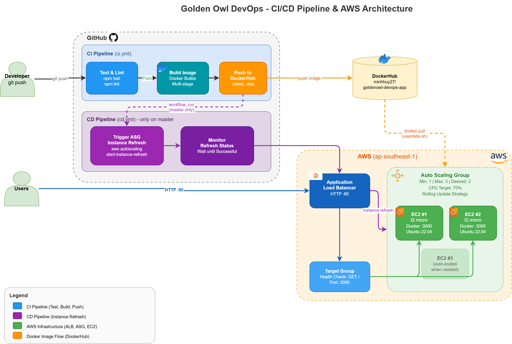
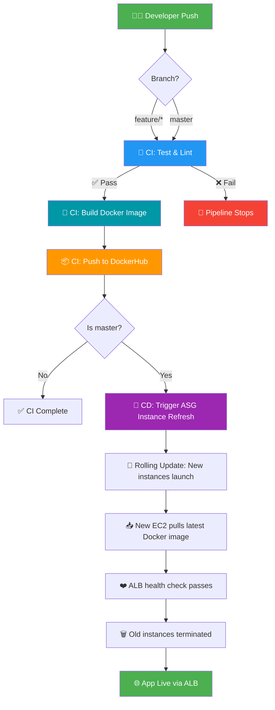

# Golden Owl DevOps Internship - Technical Test

At Golden Owl, we believe in treating infrastructure as code and automating resource provisioning to the fullest extent possible.

In this technical test, we challenge you to create a robust CI build pipeline using GitHub Actions. You have the freedom to complete this test in your local environment.

---

## 📋 Table of Contents

- [Solution Overview](#solution-overview)
- [Architecture](#architecture)
- [CI/CD Pipeline Flow](#cicd-pipeline-flow)
- [Tech Stack](#tech-stack)
- [Project Structure](#project-structure)
- [Dockerfile](#dockerfile)
- [GitHub Actions Workflows](#github-actions-workflows)
- [Infrastructure (Terraform)](#infrastructure-terraform)
- [Deployment Guide](#deployment-guide)
- [Running Locally](#running-locally)
- [Deployment Link](#deployment-link)

---

## Solution Overview

This solution implements a fully automated CI/CD pipeline that:
- **Dockerizes** a Node.js application using multi-stage builds
- **Tests & lints** code automatically on every push via GitHub Actions
- **Builds & pushes** Docker images to DockerHub
- **Deploys** to AWS using ALB + Auto Scaling Group with rolling updates
- **Provisions infrastructure** using Terraform (Infrastructure as Code)

---

## Architecture

```
                         ┌─────────────────────────────────────────────┐
                         │              AWS Cloud (ap-southeast-1)     │
                         │                                             │
┌──────────┐             │  ┌─────────────────────────────────────┐    │
│          │   HTTP:80   │  │     Application Load Balancer       │    │
│  Users   │────────────▶│  │         (goldenowl-devops-alb)      │    │
│          │             │  └──────────────┬──────────────────────┘    │
└──────────┘             │                 │                           │
                         │        ┌────────┴────────┐                  │
                         │        │   Target Group   │                  │
                         │        │   (port 3000)    │                  │
                         │        └───┬──────────┬───┘                  │
                         │            │          │                      │
                         │     ┌──────┴──┐  ┌───┴───────┐              │
                         │     │  EC2 #1 │  │   EC2 #2  │              │
                         │     │ Docker  │  │  Docker   │  Auto        │
                         │     │ :3000   │  │  :3000    │  Scaling     │
                         │     └─────────┘  └───────────┘  Group       │
                         │                                  (1-3)      │
                         └─────────────────────────────────────────────┘
```

---

## CI/CD Pipeline Flow



<details>
<summary>📊 Mermaid Diagram (interactive on GitHub)</summary>



</details>

---

## Tech Stack

| Component          | Technology                                    |
| ------------------ | --------------------------------------------- |
| Application        | Node.js 18 + Express                          |
| Containerization   | Docker (multi-stage build, `node:18-alpine`)   |
| CI Pipeline        | GitHub Actions (`ci.yml`)                      |
| CD Pipeline        | GitHub Actions (`cd.yml`) + AWS CLI            |
| Container Registry | DockerHub                                      |
| Infrastructure     | Terraform (IaC)                                |
| Load Balancer      | AWS Application Load Balancer (ALB)            |
| Auto Scaling       | AWS Auto Scaling Group (ASG) with CPU tracking |
| Compute            | AWS EC2 (`t2.micro`)                           |

---

## Project Structure

```
.
├── .github/
│   └── workflows/
│       ├── ci.yml                # CI: Test → Lint → Build → Push
│       └── cd.yml                # CD: Trigger ASG Instance Refresh
├── src/
│   ├── routes/
│   │   └── index.js              # API routes
│   ├── server/
│   │   └── index.js              # Express server setup
│   ├── tests/
│   │   ├── routes.test.js        # API endpoint tests
│   │   └── sample.test.js        # Sample test
│   ├── .dockerignore             # Docker build exclusions
│   ├── Dockerfile                # Multi-stage Docker build
│   ├── index.js                  # Application entry point
│   └── package.json              # Node.js dependencies
├── terraform/
│   ├── main.tf                   # ALB + ASG + Launch Template + Security Groups
│   ├── variables.tf              # Input variables
│   ├── outputs.tf                # Output values (ALB DNS, ASG name)
│   ├── userdata.sh               # EC2 bootstrap: install Docker + run app
│   └── terraform.tfvars.example  # Example variable values
└── README.md
```

---

## Dockerfile

The application uses a **multi-stage Dockerfile** (`src/Dockerfile`):

| Stage          | Purpose                                           |
| -------------- | ------------------------------------------------- |
| **Builder**    | Install all deps, run `npm test` during build      |
| **Production** | Copy only production deps, run as non-root user    |

Key design decisions:
- 🪶 **Alpine-based** — Image size ~50MB vs ~350MB
- 🔒 **Non-root** — Runs as `node` user for security
- ❤️ **Health check** — Built-in container health monitoring
- 📌 **Deterministic** — Uses `npm ci` for exact lockfile versions
- 🧪 **Test in build** — Failing tests prevent image creation

---

## GitHub Actions Workflows

### CI Pipeline (`ci.yml`)

| Trigger                                | Jobs                        |
| -------------------------------------- | --------------------------- |
| Push to `feature/*` or `master`, PR to `master` | Test & Lint → Build & Push |

- **Test & Lint**: `npm ci` → `npm test` → `npm run lint:check`
- **Build & Push**: Docker Buildx → Push to DockerHub with tags (`SHA`, `branch`, `latest` on master)
- Uses GitHub Actions cache for faster Docker builds

### CD Pipeline (`cd.yml`)

| Trigger                             | Job                          |
| ----------------------------------- | ---------------------------- |
| After CI succeeds on `master`       | ASG Instance Refresh         |

- Triggered via `workflow_run` (no redundant build)
- Uses AWS CLI to start **rolling instance refresh**
- Waits and monitors refresh status until completion
- **Zero-downtime deployment**: new instances launch before old ones terminate

---

## Infrastructure (Terraform)

All AWS infrastructure is provisioned with Terraform (`terraform/`):

| Resource                  | Purpose                                          |
| ------------------------- | ------------------------------------------------ |
| Application Load Balancer | Distributes traffic across instances (port 80)   |
| Target Group              | Health checks on port 3000, routes to healthy EC2 |
| Launch Template           | Defines EC2 config + userdata script              |
| Auto Scaling Group        | Maintains 1–3 instances, rolling update strategy  |
| Auto Scaling Policy       | Scale based on CPU utilization (target: 70%)      |
| Security Groups           | ALB: HTTP/HTTPS inbound. EC2: app port from ALB only |
| Key Pair                  | Auto-generated SSH key for debugging              |

### Auto Scaling Configuration

```
Min instances:      1
Max instances:      3
Desired capacity:   2
Scale trigger:      CPU > 70%
Update strategy:    Rolling (50% min healthy)
Instance warmup:    120 seconds
```

---

## Deployment Guide

### Prerequisites

1. AWS account with configured credentials (`aws configure`)
2. DockerHub account with access token
3. Terraform installed (v1.0+)

### Step 1: Provision Infrastructure

```bash
cd terraform
cp terraform.tfvars.example terraform.tfvars
# Edit terraform.tfvars: set dockerhub_image = "your-username/goldenowl-devops-app"

terraform init
terraform apply
```

### Step 2: Configure GitHub Secrets

| Secret                  | Source                         |
| ----------------------- | ------------------------------ |
| `DOCKERHUB_USERNAME`    | Your DockerHub username        |
| `DOCKERHUB_TOKEN`       | DockerHub Access Token         |
| `AWS_ACCESS_KEY_ID`     | IAM user access key            |
| `AWS_SECRET_ACCESS_KEY` | IAM user secret key            |

> **IAM Policy (Least Privilege)**: The CD user only needs `autoscaling:StartInstanceRefresh` and `autoscaling:DescribeInstanceRefreshes`.

### Step 3: Deploy

Push to `master` branch → CI builds & pushes image → CD triggers rolling update → App live on ALB.

---

## Running Locally

### Option 1: Node.js

```bash
cd src
npm install
npm test       # Run tests
npm start      # Start server on port 3000
```

### Option 2: Docker

```bash
docker build -t goldenowl-app ./src
docker run -p 3000:3000 goldenowl-app
```

### Verify

```shell
curl localhost:3000
```

Expected response:
```json
{"message":"Welcome warriors to Golden Owl!"}
```

---

## Deployment Link

> 🔗 **Live Application**: http://goldenowl-devops-alb-903237556.ap-southeast-1.elb.amazonaws.com

---

## Mission Checklist

- [x] ✅ Fork repository to personal GitHub
- [x] ✅ Dockerize Node.js application (multi-stage build)
- [x] ✅ CI/CD pipeline with GitHub Actions + DockerHub
- [x] ✅ Auto CI tests on feature branch push
- [x] ✅ CD deployment to AWS (ALB + Auto Scaling Group)
- [x] ✅ Visual flow diagram (draw.io + Mermaid)
- [x] ✅ Load Balancer (AWS ALB)
- [x] ✅ Auto Scaling (ASG with CPU-based scaling)
- [x] ✅ Infrastructure as Code (Terraform)